# Modern SDLC Workflow Visualization

This document provides visual representations of the modern SDLC workflow.

## Complete SDLC Flow

```mermaid
graph LR
    A[📝 Requirements] --> B[🔍 Analysis]
    B --> C[🗂️ Planning]
    C --> D[🎨 Design]
    D --> E[🧪 Testing Strategy]
    E --> F[💻 Implementation]
    F --> G[🛡️ Security Scan]
    G --> H[👥 Code Review]
    H --> I[🚀 Deployment]
    I --> J[📊 SRE/Observability]
    J --> K[🧑‍💼 UAT/Review]
    K --> L[📦 Release]
    L --> M[🔄 Retrospective]
    M -.-> A
    
    style A fill:#e3f2fd
    style B fill:#e1f5fe
    style C fill:#e0f7fa
    style D fill:#e0f2f1
    style E fill:#f1f8e9
    style F fill:#fff9c4
    style G fill:#fff3e0
    style H fill:#ffe0b2
    style I fill:#ffccbc
    style J fill:#ffcdd2
    style K fill:#f8bbd0
    style L fill:#e1bee7
    style M fill:#d1c4e9
```

## Shift-Left Testing Emphasis

## Automation by Stage

```mermaid
graph TD
    subgraph "Requirements - 0% Automated"
        R1[Schedule Interviews]
        R2[Conduct Interviews]
        R3[Draft Requirements]
    end
    
    subgraph "Planning - 40% Automated"
        P1[Break Down Tasks ✅]
        P2[Create Plan]
        P3[Assign Tasks ✅]
    end
    
    subgraph "Implementation - 60% Automated"
        I1[Write Code]
        I2[Auto-Lint ✅]
        I3[Auto-Test ✅]
        I4[Auto-Coverage ✅]
    end
    
    subgraph "Deployment - 100% Automated"
        D1[Auto-Build ✅]
        D2[Auto-Deploy ✅]
        D3[Auto-Monitor ✅]
    end
    
    style P1 fill:#81c784
    style P3 fill:#81c784
    style I2 fill:#81c784
    style I3 fill:#81c784
    style I4 fill:#81c784
    style D1 fill:#81c784
    style D2 fill:#81c784
    style D3 fill:#81c784
```

## Human vs Automated Decision Points

```mermaid
flowchart TD
    Start[New Feature Request] --> A{Strategic Decision?}
    A -->|Yes| H1[👤 Human Reviews]
    A -->|No| Auto1[🤖 AI Suggests]
    
    H1 --> B[Create Requirements]
    Auto1 --> H2[👤 Human Approves]
    H2 --> B
    
    B --> C[Write Code]
    C --> D{Quality Checks}
    
    D --> Auto2[🤖 Auto-Lint]
    D --> Auto3[🤖 Auto-Test]
    D --> Auto4[🤖 Auto-Security Scan]
    
    Auto2 --> E{All Checks Pass?}
    Auto3 --> E
    Auto4 --> E
    
    E -->|No| F[🤖 AI Suggests Fixes]
    F --> H3[👤 Human Fixes]
    H3 --> C
    
    E -->|Yes| G[👤 Human Code Review]
    G --> H{Approved?}
    H -->|No| C
    H -->|Yes| I[🤖 Auto-Deploy]
    I --> J[🤖 Auto-Monitor]
    J --> K{Issues Detected?}
    K -->|Yes| L[🤖 Alert Humans]
    K -->|No| End[✅ Success]
    
    style H1 fill:#bbdefb
    style H2 fill:#bbdefb
    style H3 fill:#bbdefb
    style G fill:#bbdefb
    style Auto1 fill:#c8e6c9
    style Auto2 fill:#c8e6c9
    style Auto3 fill:#c8e6c9
    style Auto4 fill:#c8e6c9
    style F fill:#c8e6c9
    style I fill:#c8e6c9
    style J fill:#c8e6c9
```

## Stage Details with Step Counts

## Pre-Merge Quality Gates (Shift-Left)

## Automation Breakdown

**Key Insights**:
- **68.5% Human Required**: Strategic decisions, creative work, stakeholder communication
- **31.5% Fully Automated**: Repetitive tasks, quality checks, deployments
- **Highest Automation**: Deployment (100%), Implementation (60%), Planning (40%)
- **Lowest Automation**: Requirements, Analysis, Design, Security, Code Review (0%)

## SDLC Infrastructure Setup Roadmap

> [!IMPORTANT]
> This roadmap shows how to **SET UP your SDLC tooling and infrastructure**, NOT the order of development activities.
> 
> For the actual development workflow order, see the "Complete SDLC Flow" diagram above:
> Requirements → Analysis → Planning → Design → Testing Strategy → **Implementation** → Security → Code Review → **SRE/Observability** → Deployment → UAT → Release → Retrospective

**Note**: This is a one-time setup process. Once your SDLC infrastructure is in place, every feature follows the normal development workflow: Requirements → Analysis → Planning → Design → Testing Strategy → Implementation → Security → Code Review → SRE/Observability → Deployment → UAT → Release → Retrospective.

---

## Quick Reference

### Fully Automated Steps (No Human Required)
1. **Planning**: Break down features, Assign tasks
2. **Testing**: Write unit tests, Write integration tests
3. **Implementation**: Linting, Lint fixes, Unit tests, Integration tests, Coverage checks
4. **Deployment**: Build, Deploy, Monitor

### Critical Human Decision Points
1. **Requirements**: All stakeholder interactions
2. **Analysis**: Feasibility, Prioritization
3. **Design**: Creative decisions
4. **Security**: Security issue remediation
5. **Code Review**: Final approval
6. **SRE/Observability**: Telemetry, alerts, runbooks, SLIs/SLOs
7. **UAT**: Stakeholder validation
8. **Retrospective**: Team learning

### Shift-Left Wins
- ✅ Tests run on PR (not post-merge)
- ✅ Security scans on PR (not in production)
- ✅ Linting on PR (not during review)
- ✅ Coverage checks on PR (not after deployment)

**Result**: Catch issues earlier, fix them faster, deploy with confidence!
