# SDLC Environment Strategy (v4) - Production-Grade Workflow

## Overview

This document defines a **production-grade environment strategy** with ephemeral regression testing, blue/green deployments, and optimized build artifacts. This represents real-world enterprise SDLC practices.

## What's New in v4

v3 was a simplified 5-tier model. **v4 reflects actual production workflows**:

- **8 environments** (not 5): Adds QA Regression (ephemeral), separates QA/Dev persistent, adds Pre-Prod
- **4 build stages**: Different builds for different purposes (with/without instrumentation)
- **Blue/Green deployments**: UAT and Production use zero-downtime deployment strategy
- **Human approval gates**: 2-hour objection period, 1-hour confirmation before prod cutover
- **Ephemeral QA regression**: Prevents instability in persistent QA/Dev environment

---

## The 8 Environment Tiers

### 1. Local Development 🖥️

**Purpose**: Developer's machine for rapid iteration

**Characteristics**:
- Runs on laptop/desktop
- Connects to shared dev backend services
- Hot reload for instant feedback
- Full debugging capabilities

**Build**: Build #1 (WITH code coverage instrumentation)

**Testing**: Unit tests, local integration tests

**Lifespan**: Permanent (developer's machine)

---

### 2. Personal Dev Environment ☁️

**Purpose**: Developer's personal cloud sandbox for integration testing

**Characteristics**:
- Isolated k8s namespace (e.g., `dev-yourname`)
- Deploys ONLY your service/UI
- Connects to shared dev services (not in your namespace)
- Accessible via unique URL

**Deployment**:
```bash
./scripts/deploy-personal-dev.sh
# Builds Docker image locally
# Deploys to your k8s namespace
# Routes to shared dev backend
```

**Build**: Build #1 (WITH instrumentation, built locally)

**Testing**: Manual integration testing, cross-service validation

**Lifespan**: Weeks/months (until manually deleted)

---

### 3. PR Environment (Ephemeral) 🔄

**Purpose**: Isolated environment per pull request with full E2E testing

**Characteristics**:
- **Ephemeral**: Created on PR open, destroyed on PR close/merge
- **Isolated**: Full stack deployment (all UIs + all backends + database)
- **Automated**: Triggered by CI/CD on PR creation
- **Quality Gates**: Must pass before merge eligible

**Lifecycle**:
```
PR Created → Build #2 → Deploy Full Stack → Run E2E Tests → Quality Gates → Merge Eligible
                                                                            ↓
                                                                       PR Closed/Merged → Destroy
```

**Build**: Build #2 (WITH code coverage instrumentation)

**Testing**:
- Unit tests
- Integration tests (new feature E2E tests)
- Regression tests (existing feature E2E tests)
- Code coverage analysis
- Security scans (SAST, dependency scanning)
- Linting

**Quality Gates**:
- ✅ All tests pass
- ✅ Code coverage meets threshold (e.g., 80%)
- ✅ No critical vulnerabilities
- ✅ Linting passes

**Lifespan**: Hours/days (PR lifetime)

**URL**: `https://pr-1234.company.com`

---

### 4. QA/Dev Regression Environment (Ephemeral) 🧪

**Purpose**: Scheduled regression testing from main branch in ephemeral environment

**Characteristics**:
- **Ephemeral**: Created by scheduled build, destroyed after tests pass
- **Full Stack**: Complete deployment (all UIs + all backends + database)
- **Scheduled**: Runs on schedule (e.g., nightly, or on every main branch commit)
- **Prevents Instability**: Tests in isolation BEFORE deploying to persistent QA/Dev

**Trigger**: Scheduled build or main branch commit

**Lifecycle**:
```
Scheduled Trigger → Build #3 → Deploy Full Stack → Run E2E Tests → Quality Gates
                                                                      ↓
                                                                   ✅ Pass → Build #4 (no instrumentation)
                                                                      ↓
                                                                   Deploy to QA/Dev (persistent)
                                                                      ↓
                                                                   Destroy Regression Env
```

**Build**: Build #3 (WITH code coverage instrumentation)

**Testing**:
- Unit tests
- Integration tests
- Regression tests (full E2E suite)
- Code coverage analysis
- Security scans
- Performance tests

**Why Ephemeral?**
- Prevents breaking the persistent QA/Dev environment
- Clean slate for every regression run
- Cost-effective (destroyed after use)

**Lifespan**: Minutes/hours (test execution time)

---

### 5. QA/Dev Environment (Persistent) 🏗️

**Purpose**: Persistent shared environment for manual testing and integration

**Characteristics**:
- **Persistent**: Long-lived, shared by team
- **Deployed AFTER** QA regression passes
- **No Instrumentation**: Uses Build #4 (optimized for performance)
- **Stable**: Only updated when regression tests pass

**Deployment**: Automatic after QA regression passes

**Build**: Build #4 (WITHOUT code coverage instrumentation)

**Testing**: Manual exploratory testing, integration validation

**Lifespan**: Permanent

**URL**: `https://dev.company.com` or `https://qa.company.com`

**Note**: QA and Dev are the same environment, just different names

---

### 6. UAT Blue/Green 🎭

**Purpose**: User Acceptance Testing with zero-downtime deployment

**Characteristics**:
- **Blue/Green**: Two identical environments (blue = next, green = current)
- **Zero Downtime**: Traffic switches between blue/green
- **Same Image**: Uses Build #4 from QA/Dev (no rebuild)

**Deployment Flow**:
```
Deploy to UAT Blue → Run Smoke Tests → ✅ Pass → Flip Blue to Green
                                                   ↓
                                              Old Green becomes new Blue
```

**Build**: Build #4 (same image from QA/Dev, no instrumentation)

**Testing**: Smoke tests (subset of E2E tests)

**Blue/Green Benefits**:
- Zero downtime during deployment
- Instant rollback if issues found
- Production-like testing before prod

**Lifespan**: Permanent (both blue and green)

**URLs**:
- Blue: `https://uat-blue.company.com`
- Green: `https://uat.company.com` (active)

---

### 7. Pre-Production 🚦

**Purpose**: Final validation before production

**Characteristics**:
- **No Blue/Green**: Single environment (cost/complexity trade-off)
- **Human Gated**: Requires operator approval to deploy
- **Same Image**: Uses Build #4 from QA/Dev

**Deployment**: Manual trigger by human operator (if not occupied by next release testing)

**Build**: Build #4 (same image, no instrumentation)

**Testing**: Smoke tests (subset of E2E tests)

**Human Gate**: Operator checks if pre-prod is free before deploying

**Lifespan**: Permanent

**URL**: `https://pre-prod.company.com`

**Why No Blue/Green?**
- Cost: Blue/green doubles infrastructure
- Complexity: Managing one release at a time
- Risk: Lower than prod, can tolerate brief downtime

---

### 8. Production Blue/Green 🚀

**Purpose**: Live environment serving real users with zero-downtime deployment

**Characteristics**:
- **Blue/Green**: Two identical production environments
- **Human Approval Gates**: Multiple checkpoints before cutover
- **Same Image**: Uses Build #4 from QA/Dev
- **24/7 Monitoring**: Full observability

**Deployment Flow**:
```
Human informs PO/team → 2-hour objection period → No objections?
                                                    ↓
                                                 Deploy to Prod Blue
                                                    ↓
                                                 Run Smoke Tests
                                                    ↓
                                                 ✅ Pass → Wait 1 hour
                                                    ↓
                                                 Get confirmation
                                                    ↓
                                                 Flip Blue to Green
                                                    ↓
                                                 Old Green becomes new Blue
```

**Build**: Build #4 (same image, no instrumentation)

**Testing**: Smoke tests, post-deployment monitoring

**Human Gates**:
1. **2-hour objection period**: PO/team can object before deployment
2. **1-hour soak period**: Monitor prod blue before cutover
3. **Final confirmation**: Explicit approval to flip to green

**Lifespan**: Permanent (both blue and green)

**URLs**:
- Blue: `https://prod-blue.company.com` (next)
- Green: `https://app.company.com` (live, users access this)

---

## The 4 Build Stages

### Build #1: Local Development (WITH Instrumentation)
- **Where**: Developer's laptop
- **Purpose**: Local feature development and debugging
- **Instrumentation**: YES (code coverage for local testing)
- **Deployed To**: Local environment, Personal Dev environment

### Build #2: PR Regression (WITH Instrumentation)
- **Where**: CI/CD pipeline (on PR creation)
- **Purpose**: PR validation with full test coverage
- **Instrumentation**: YES (code coverage analysis required)
- **Deployed To**: PR environment (ephemeral)
- **Destroyed**: When PR is closed/merged

### Build #3: QA Regression (WITH Instrumentation)
- **Where**: CI/CD pipeline (scheduled or on main commit)
- **Purpose**: Main branch regression testing with coverage
- **Instrumentation**: YES (code coverage analysis required)
- **Deployed To**: QA Regression environment (ephemeral)
- **Destroyed**: After tests pass and Build #4 is created

### Build #4: Release Candidate (WITHOUT Instrumentation)
- **Where**: CI/CD pipeline (after QA regression passes)
- **Purpose**: Production-ready optimized build
- **Instrumentation**: NO (performance optimized)
- **Deployed To**: QA/Dev → UAT Blue/Green → Pre-Prod → Prod Blue/Green
- **Why Remove Instrumentation?**
  - **Performance**: 10-30% faster execution
  - **Resource Usage**: Lower CPU/memory consumption
  - **Code Size**: Smaller deployment artifacts
  - **Optimization**: Allows full compiler optimizations

**Key Insight**: Same Docker image (Build #4) is promoted through QA/Dev → UAT → Pre-Prod → Prod. No rebuilding!

---

## Complete Environment Flow Diagram

```mermaid
graph TD
    A[💻 Local Dev<br/>Build #1] -->|Deploy| B[☁️ Personal Dev<br/>Build #1]
    B -->|Create PR| C[🔄 PR Env<br/>Build #2<br/>Ephemeral]
    C -->|E2E Tests| D{Quality Gates}
    D -->|❌ Fail| E[🔧 Fix Issues]
    E --> A
    D -->|✅ Pass| F[✔️ Merge Eligible]
    F -->|Merge to main| G[🧪 QA Regression<br/>Build #3<br/>Ephemeral]
    
    G -->|E2E Tests| H{Regression Pass?}
    H -->|❌ Fail| I[🚨 Alert Team]
    H -->|✅ Pass| J[🏗️ Build #4<br/>No Instrumentation]
    
    J -->|Deploy| K[🏗️ QA/Dev Persistent<br/>Build #4]
    K -->|Deploy| L[🎭 UAT Blue<br/>Build #4]
    L -->|Smoke Tests| M{UAT Pass?}
    M -->|✅ Pass| N[🔄 Flip to UAT Green]
    
    N -->|Human Gate| O[🚦 Pre-Prod<br/>Build #4]
    O -->|Smoke Tests| P{Pre-Prod Pass?}
    P -->|✅ Pass| Q[📢 Notify PO/Team<br/>2hr objection period]
    
    Q -->|No objections| R[🚀 Prod Blue<br/>Build #4]
    R -->|Smoke Tests| S{Prod Blue Pass?}
    S -->|✅ Pass| T[⏰ Wait 1 hour<br/>Monitor]
    T -->|Confirmation| U[🔄 Flip to Prod Green<br/>LIVE!]
    
    C -->|PR Closed| V[💥 Destroy PR Env]
    G -->|Tests Complete| W[💥 Destroy QA Regression]
    
    style A fill:#e3f2fd
    style B fill:#fff9c4
    style C fill:#c8e6c9
    style G fill:#ffe0b2
    style J fill:#f8bbd0
    style K fill:#d1c4e9
    style L fill:#ffccbc
    style O fill:#ffecb3
    style R fill:#c5e1a5
    style U fill:#81c784
    style V fill:#ffcdd2
    style W fill:#ffcdd2
```



---

## Environment Comparison Matrix

| Environment | Type | Lifespan | Build | Instrumentation | Testing | Blue/Green | Human Gate | Access |
|-------------|------|----------|-------|-----------------|---------|------------|------------|--------|
| **Local** | Dev | Permanent | #1 | YES | Unit | No | No | Developer |
| **Personal Dev** | Dev | Days/Weeks | #1 | YES | Manual/E2E | No | No | Developer |
| **PR Regression** | Test | Hours | #2 | YES | Full E2E | No | No | CI/CD |
| **QA Regression** | Test | Hours | #3 | YES | Full E2E | No | No | CI/CD |
| **QA/Dev** | Persistent | Permanent | #4 | NO | Manual | No | No | Team |
| **UAT** | UAT | Permanent | #4 | NO | Smoke | YES | YES | Team |
| **Pre-Prod** | Pre-Prod | Permanent | #4 | NO | Smoke | NO | YES | Team |
| **Production** | Live | Permanent | #4 | NO | Smoke | YES | YES | Users |

---

## Test Terminology Evolution

All tests are **E2E tests** that hit the real live system (login, API calls, database interactions). The terminology changes based on the feature lifecycle:

### Integration Tests
- **When**: Feature is NEW
- **Purpose**: Test new feature integration with existing system
- **Created By**: Developers
- **Example**: Testing new payment gateway integration

### User Acceptance Tests (UAT)
- **When**: Feature needs PO/user validation
- **Purpose**: Verify feature meets business requirements
- **Created By**: PO and developers jointly
- **Example**: PO-defined scenarios for new checkout flow

### Regression Tests
- **When**: Feature becomes PERMANENT part of system
- **Purpose**: Ensure new changes don't break existing features
- **Created By**: Evolved from integration/UAT tests
- **Example**: Login flow, payment processing, user registration

### Smoke Tests
- **When**: Post-deployment validation
- **Purpose**: Quick sanity check that system is functional
- **Created By**: Selected subset of regression tests
- **Example**: Can users log in? Can they view dashboard?
- **Run In**: UAT, Pre-Prod, Production (post-deployment)

**Key Insight**: Integration tests → UAT tests → Regression tests are all E2E tests, just at different lifecycle stages!

---

## Blue/Green Deployment Strategy

### What is Blue/Green?

Two identical environments:
- **Blue**: Next version (being deployed/tested)
- **Green**: Current version (serving users)

After blue is validated, traffic switches to blue, and old green becomes new blue.

### Where We Use Blue/Green

| Environment | Blue/Green? | Why? |
|-------------|-------------|------|
| UAT | ✅ YES | Zero-downtime UAT testing, production-like validation |
| Pre-Prod | ❌ NO | Cost/complexity trade-off, managing one release at a time |
| Production | ✅ YES | Zero downtime for users, instant rollback capability |

### UAT Blue/Green Flow

```
1. Deploy Build #4 to UAT Blue
2. Run smoke tests on UAT Blue
3. ✅ Smoke tests pass
4. Flip: UAT Blue becomes UAT Green (users now access blue)
5. Old UAT Green becomes new UAT Blue (ready for next deployment)
```

### Production Blue/Green Flow

```
1. Deploy Build #4 to Pre-Prod
2. Run smoke tests on Pre-Prod
3. Notify PO/team (2-hour objection period)
4. No objections? Deploy Build #4 to Prod Blue
5. Run smoke tests on Prod Blue
6. ✅ Smoke tests pass
7. Wait 1 hour (soak period, monitor metrics)
8. Get final confirmation
9. Flip: Prod Blue becomes Prod Green (users now access blue)
10. Old Prod Green becomes new Prod Blue (ready for next deployment)
```

### Benefits of Blue/Green

- **Zero Downtime**: Users never experience outage
- **Instant Rollback**: Just flip back to green if issues found
- **Production Testing**: Test in prod-like environment before exposing to users
- **Reduced Risk**: Validate thoroughly before cutover

### Why Pre-Prod Doesn't Have Blue/Green

- **Cost**: Doubles infrastructure (2x servers, 2x databases)
- **Complexity**: More moving parts to manage
- **Single Release**: Only managing one release at a time
- **Lower Risk**: Pre-prod downtime doesn't affect users
- **Trade-off**: Acceptable brief downtime in pre-prod vs. cost/complexity

---

## Human Approval Gates

### Gate 1: Pre-Prod Deployment
- **Who**: Human operator
- **When**: Before deploying to pre-prod
- **Check**: Is pre-prod free (not occupied by next release testing)?
- **Action**: Manually trigger deployment if clear

### Gate 2: Production Notification
- **Who**: Human operator
- **When**: After pre-prod smoke tests pass
- **Action**: Notify PO/team of impending prod deployment
- **Wait**: 2-hour objection period
- **Purpose**: Give stakeholders chance to halt deployment

### Gate 3: Production Cutover
- **Who**: Human operator
- **When**: After prod blue smoke tests pass and 1-hour soak
- **Action**: Get explicit confirmation before flipping blue to green
- **Purpose**: Final safety check before exposing to users

---

## Today vs Tomorrow: Migration Path

### Today (Current State)

**Step 5**: QA regression deploys directly to persistent QA/Dev environment
- ❌ Risk: Can break QA/Dev environment
- ❌ No isolation: Tests run in shared environment

**Step 6**: Rebuild image for UAT deployment
- ❌ Inefficient: Rebuilding same code
- ❌ Risk: Different build might have different behavior

### Tomorrow (Target State)

**Step 5**: QA regression runs in ephemeral environment
- ✅ Isolated: Won't break QA/Dev
- ✅ Clean slate: Fresh environment every time
- ✅ Only deploys to QA/Dev after passing

**Step 6**: Reuse Build #4 image for UAT
- ✅ Efficient: No rebuild
- ✅ Consistent: Same image tested in QA regression
- ✅ Faster: Just deploy, no compile/build step

---

## Cost Optimization

### Ephemeral Environment Costs

| Environment | Cost Impact | Mitigation |
|-------------|-------------|------------|
| PR Regression | Low | Auto-destroy on close, resource limits |
| QA Regression | Medium | Auto-destroy on close, resource a bit more |

### Cost Savings

- **PR regression**: Destroyed on close (not running 24/7)
- **QA regression**: Destroyed on close (not running 24/7)
- **Pre-prod**: No blue/green (50% cost savings vs. blue/green)
- **Build reuse**: Build #4 used across 4 environments (no rebuilding)

---


## Success Metrics

### Environment Health

- **PR Environment**: Creation time < 5 min, test execution < 15 min
- **QA Regression**: Total time < 30 min (create → test → destroy)
- **UAT Deployment**: Blue/green flip < 30 seconds
- **Production Deployment**: Zero downtime, rollback capability < 2 min

### Quality Metrics

- **PR Merge Rate**: % of PRs that pass quality gates on first try
- **QA Regression Pass Rate**: % of scheduled builds that pass
- **Production Incidents**: Number of rollbacks needed
- **Mean Time to Recovery (MTTR)**: Time to rollback if issues found

### Cost Metrics

- **Ephemeral Environment Cost**: $ per PR, $ per QA regression run
- **Infrastructure Utilization**: % of time environments are active
- **Build Efficiency**: Time saved by reusing Build #4

---

## References

- [Blue-Green Deployment Best Practices](https://octopus.com/blog/blue-green-deployments)
- [Ephemeral Regression Testing](https://ephemeralenvironments.io)
- [Code Coverage Instrumentation Impact](https://antithesis.com/blog/code-coverage-instrumentation-performance/)
- [Kubernetes Resource Quotas](https://kubernetes.io/docs/concepts/policy/resource-quotas/)

---

**This v4 environment strategy represents production-grade SDLC with enterprise best practices for quality, reliability, and zero-downtime deployments.**
